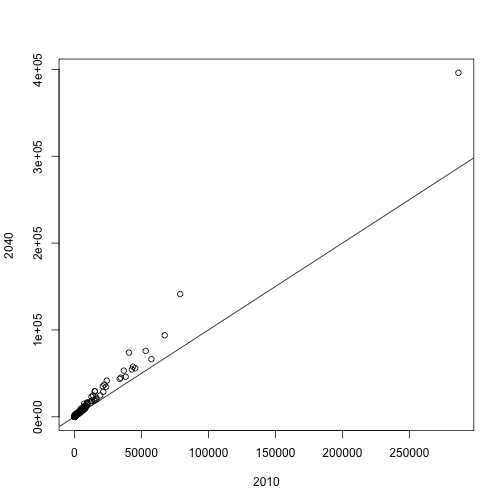
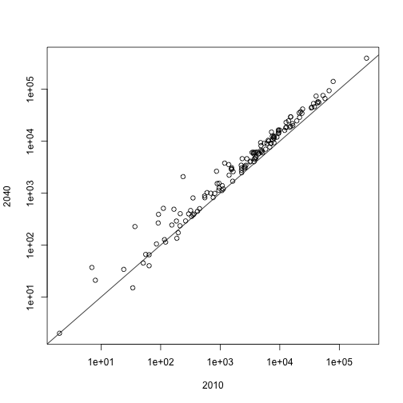
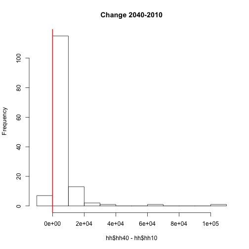
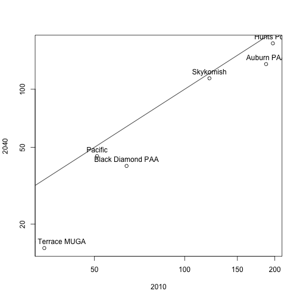
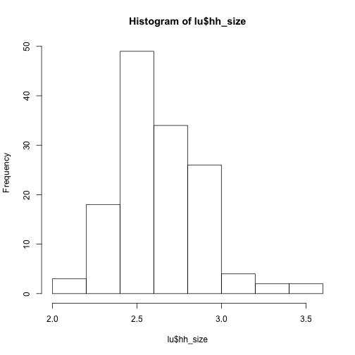
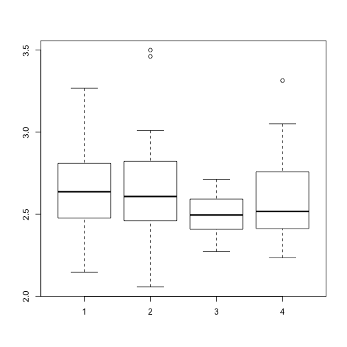
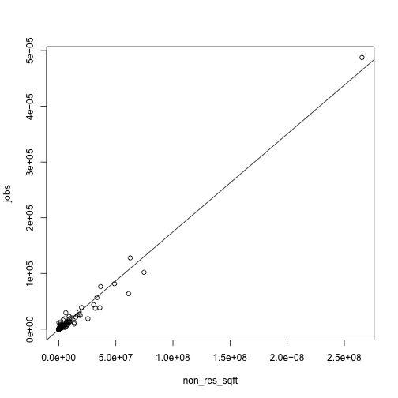

> ## Learning Objectives {.objectives}
>
> * To be able to summarize and visualize data.
>

## Data manipulation

Let's try vectorisation on the `hh40` column of the `hh` dataset.
First remove rows with NA. Then make a new column in the `hh` data frame that
contains households in units of thousands of people.

~~~{.r}
hh <- na.omit(hh)
hh$hh40inT <- hh$hh40 / 1000
head(hh)
~~~

~~~{.output}
  county_id city_id  hh10  hh20  hh30  hh40         city_name county_name
3         1     109 14853 17874 18051 18542      Everett MUGA   Snohomish
4         1     113  9488 12157 13841 15639      Lake Stevens   Snohomish
5         1     110  4836  5808  6218  6688            Monroe   Snohomish
6         1     108  4464  4986  5398  5873     Mukilteo MUGA   Snohomish
7         1     104  1409  1474  1836  2215 Larch Way Overlap   Snohomish
8         1     105  7804 10878 11153 11644      Bothell MUGA   Snohomish
  hh40inT
3  18.542
4  15.639
5   6.688
6   5.873
7   2.215
8  11.644

~~~
Create a log transformation:

~~~{.r}
hhlog <- hh
hhlog[,2:6] <- log(hhlog[,2:6])
head(hhlog)
~~~

~~~{.output}
  county_id  city_id     hh10     hh20     hh30     hh40         city_name
3         1 4.691348 9.605957 9.791102 9.800956 9.827794      Everett MUGA
4         1 4.727388 9.157783 9.405660 9.535390 9.657523      Lake Stevens
5         1 4.700480 8.483843 8.666992 8.735204 8.808070            Monroe
6         1 4.682131 8.403801 8.514389 8.593784 8.678121     Mukilteo MUGA
7         1 4.644391 7.250636 7.295735 7.515345 7.703008 Larch Way Overlap
8         1 4.653960 8.962392 9.294498 9.319464 9.362546      Bothell MUGA
  county_name hh40inT
3   Snohomish  18.542
4   Snohomish  15.639
5   Snohomish   6.688
6   Snohomish   5.873
7   Snohomish   2.215
8   Snohomish  11.644

~~~

Create a dataset of differences:

~~~{.r}
hhdif <- cbind(data.frame(city_id=hh$city_id), hh[,3:5] - hh[,2:4])
head(hhdif)
~~~

~~~{.output}
  city_id  hh10 hh20 hh30
3     109 14744 3021  177
4     113  9375 2669 1684
5     110  4726  972  410
6     108  4356  522  412
7     104  1305   65  362
8     105  7699 3074  275

~~~

~~~{.r}
summary(hhdif)
~~~

~~~{.output}
    city_id            hh10               hh20              hh30         
 Min.   :  1.00   Min.   :  -136.0   Min.   :  -92.0   Min.   : -359.00  
 1st Qu.: 35.75   1st Qu.:   408.8   1st Qu.:   46.0   1st Qu.:   46.75  
 Median : 71.50   Median :  3419.5   Median :  601.5   Median :  285.00  
 Mean   : 71.12   Mean   : 10362.6   Mean   : 1891.5   Mean   : 1289.60  
 3rd Qu.:106.25   3rd Qu.:  9040.5   3rd Qu.: 1778.2   3rd Qu.: 1229.50  
 Max.   :142.00   Max.   :286516.0   Max.   :48991.0   Max.   :27976.00  

~~~

## Scatter plot, histogram, boxplot

Plot results:

~~~{.r}
plot(hh$hh10, hh$hh40, xlab="2010", ylab="2040")
abline(0,1)
~~~

~~~{.r}
plot(hh$hh10, hh$hh40, xlab="2010", ylab="2040", log="xy")
~~~

~~~{.error}
Warning in xy.coords(x, y, xlabel, ylabel, log): 2 x values <= 0 omitted
from logarithmic plot

~~~

~~~{.r}
abline(0,1)
~~~

~~~{.r}
hist(hh$hh40 - hh$hh10, main="Change 2040-2010")
abline(v=0, lwd=2, col="red")
~~~

Investigate records with negative change between 2040 and 2010:

~~~{.r}
neg <- hh[hh$hh40 - hh$hh10 < 0, ]
dim(neg)
~~~

~~~{.output}
[1] 6 9

~~~

~~~{.r}
plot(neg$hh10, neg$hh40, xlab="2010", ylab="2040", log="xy")
text(neg$hh10, neg$hh40, labels=neg$city_name, pos=3)
abline(0,1)
~~~

Let's bring in a dataset with multiple land use indicators from 2010, merge it with city names and omit records with missing values:

~~~{.r}
lu <- read.table(file="data/city__dataset_table__lu_indicators__2010.tab", header=TRUE, sep="\t")
lu <- merge(lu, cities, by="city_id", all=TRUE)
lu <- na.omit(lu)
summary(lu)
~~~

~~~{.output}
    city_id            jobs            households         population    
 Min.   :  1.00   Min.   :     0.0   Min.   :     0.0   Min.   :     0  
 1st Qu.: 35.75   1st Qu.:   213.5   1st Qu.:   523.5   1st Qu.:  1302  
 Median : 71.50   Median :  2000.0   Median :  3501.5   Median :  8694  
 Mean   : 71.12   Mean   : 12684.2   Mean   : 10433.7   Mean   : 25836  
 3rd Qu.:106.25   3rd Qu.:  8685.0   3rd Qu.:  9080.2   3rd Qu.: 22885  
 Max.   :142.00   Max.   :487626.0   Max.   :286525.0   Max.   :589269  
   res_units         non_res_sqft         land_value       
 Min.   :     0.0   Min.   :        0   Min.   :2.247e+05  
 1st Qu.:   576.8   1st Qu.:   117606   1st Qu.:4.829e+07  
 Median :  3747.5   Median :  1089404   Median :2.794e+08  
 Mean   : 11422.9   Mean   :  7736671   Mean   :9.140e+08  
 3rd Qu.:  9923.5   3rd Qu.:  5143938   3rd Qu.:6.324e+08  
 Max.   :310493.0   Max.   :265491636   Max.   :3.036e+10  
   buildings        occupied_res_units  sf_res_units   
 Min.   :     0.0   Min.   :     0.0   Min.   :     0  
 1st Qu.:   480.5   1st Qu.:   523.5   1st Qu.:   476  
 Median :  2661.5   Median :  3501.5   Median :  2534  
 Mean   :  8224.0   Mean   : 10433.7   Mean   :  7807  
 3rd Qu.:  6986.5   3rd Qu.:  9080.2   3rd Qu.:  6734  
 Max.   :171283.0   Max.   :286525.0   Max.   :153726  
      sqft            city_name           county_id    
 Min.   :1.428e+05   Length:140         Min.   :1.000  
 1st Qu.:2.516e+07   Class :character   1st Qu.:1.000  
 Median :8.993e+07   Mode  :character   Median :2.000  
 Mean   :1.073e+09                      Mean   :2.121  
 3rd Qu.:2.094e+08                      3rd Qu.:3.000  
 Max.   :4.748e+10                      Max.   :4.000  

~~~
Say we want to look at the distribution of the average household sizes by counties. First, create a column for household size:  

~~~{.r}
lu <- cbind(lu, hh_size=lu$population/lu$households)
head(lu[order(lu$hh_size),])
~~~

~~~{.output}
    city_id   jobs households population res_units non_res_sqft
9         9 487626     286525     589269    310493    265491636
119     119      6         34         73        62            0
52       52     70        121        261       132       118973
77       77   9093       3419       7641      3684      5902719
65       65  29462      15310      34791     17003      6168649
82       82    153        349        805       417       117854
     land_value buildings occupied_res_units sf_res_units       sqft
9   30357550147    171283             286525       153726 1757333047
119      712861        21                 34            9     155510
52      3047934       155                121          153    7712744
77    355165636      3053               3419         2773  141504525
65    628643417     11943              15310        10414  720426378
82     18713040       449                349          431    6044453
                 city_name county_id  hh_size
9                  Seattle         2 2.056606
119 Mountlake Terrace MUGA         1 2.147059
52               Skykomish         2 2.157025
77              Gig Harbor         4 2.234864
65               Bremerton         3 2.272436
82                  Ruston         4 2.306590

~~~

~~~{.r}
tail(lu[order(lu$hh_size),])
~~~

~~~{.output}
    city_id  jobs households population res_units non_res_sqft land_value
132     132  3555         56        183        57      2852584  104873190
75       75 11949       1389       4604      2418       116203  373175945
24       24    89         91        315       110        23187   18213263
36       36     0          2          7         2            0     224744
134     134  3293          0          0         0      3445822  327479104
136     136     0          0          0         0            0    5013913
    buildings occupied_res_units sf_res_units      sqft        city_name
132       246                 56          244  33209766       Maltby UGA
75         29               1389           29 747249491             JBLM
24         88                 91           87  32740944    Sammamish PAA
36          2                  2            2    266690    Newcastle PAA
134        43                  0           43  50220760 PAINE FIELD AREA
136         0                  0            0   5039471     Woodway MUGA
    county_id  hh_size
132         1 3.267857
75          4 3.314615
24          2 3.461538
36          2 3.500000
134         1      NaN
136         1      NaN

~~~
Second, create a histogram for all cities, and a box plot by counties:

~~~{.r}
hist(lu$hh_size)
~~~

~~~{.r}
boxplot(hh_size ~ county_id, lu)
~~~

## Simple regression
Here is a simple regression for our lu dataset:

~~~{.r}
plot(jobs ~ non_res_sqft, lu)
fit <- lm(jobs ~ non_res_sqft, lu)
summary(fit)
~~~

~~~{.output}

Call:
lm(formula = jobs ~ non_res_sqft, data = lu)

Residuals:
   Min     1Q Median     3Q    Max 
-42912   -373    855   1081  22487 

Coefficients:
               Estimate Std. Error t value Pr(>|t|)    
(Intercept)  -8.965e+02  6.274e+02  -1.429    0.155    
non_res_sqft  1.755e-03  2.395e-05  73.296   <2e-16 ***
---
Signif. codes:  0 '***' 0.001 '**' 0.01 '*' 0.05 '.' 0.1 ' ' 1

Residual standard error: 7092 on 138 degrees of freedom
Multiple R-squared:  0.975,	Adjusted R-squared:  0.9748 
F-statistic:  5372 on 1 and 138 DF,  p-value: < 2.2e-16

~~~

~~~{.r}
abline(fit)
~~~

~~~{.r}
cor(lu$jobs, lu$non_res_sqft)
~~~

~~~{.output}
[1] 0.9873986

~~~
Try to add another variable:

~~~{.r}
summary(lm(jobs ~ non_res_sqft + population, lu))
~~~

~~~{.output}

Call:
lm(formula = jobs ~ non_res_sqft + population, data = lu)

Residuals:
   Min     1Q Median     3Q    Max 
-42432   -362    949   1133  22553 

Coefficients:
               Estimate Std. Error t value Pr(>|t|)    
(Intercept)  -1.026e+03  6.714e+02  -1.528    0.129    
non_res_sqft  1.723e-03  6.359e-05  27.092   <2e-16 ***
population    1.474e-02  2.673e-02   0.551    0.582    
---
Signif. codes:  0 '***' 0.001 '**' 0.01 '*' 0.05 '.' 0.1 ' ' 1

Residual standard error: 7110 on 137 degrees of freedom
Multiple R-squared:  0.975,	Adjusted R-squared:  0.9746 
F-statistic:  2673 on 2 and 137 DF,  p-value: < 2.2e-16

~~~

Or remove the intercept:

~~~{.r}
fit <- lm(jobs ~ -1 + non_res_sqft, lu)
summary(fit)
~~~

~~~{.output}

Call:
lm(formula = jobs ~ -1 + non_res_sqft, data = lu)

Residuals:
   Min     1Q Median     3Q    Max 
-43189  -1225    -30    193  24274 

Coefficients:
              Estimate Std. Error t value Pr(>|t|)    
non_res_sqft 1.745e-03  2.297e-05   75.99   <2e-16 ***
---
Signif. codes:  0 '***' 0.001 '**' 0.01 '*' 0.05 '.' 0.1 ' ' 1

Residual standard error: 7119 on 139 degrees of freedom
Multiple R-squared:  0.9765,	Adjusted R-squared:  0.9763 
F-statistic:  5775 on 1 and 139 DF,  p-value: < 2.2e-16

~~~

~~~{.r}
names(fit)
~~~

~~~{.output}
 [1] "coefficients"  "residuals"     "effects"       "rank"         
 [5] "fitted.values" "assign"        "qr"            "df.residual"  
 [9] "xlevels"       "call"          "terms"         "model"        

~~~

## Saving plots
You can save a plot from within RStudio using the 'Export' button
in the 'Plot' window. This will give you the option of saving as a
.pdf or as .png, .jpg or other image formats.

Sometimes you will want to save plots without creating them in the
'Plot' window first. Perhaps you want to make a pdf document with
multiple pages: each one a different plot, for example. Or perhaps
you're looping through multiple subsets of a file, plotting data from
each subset, and you want to save each plot, but obviously can't stop
the loop to click 'Export' for each one.

In this case you can use a more flexible approach. The function
`pdf` creates a new pdf device. You can control the size and resolution
using the arguments to this function.

~~~{.r}
pdf("myplot.pdf", width=12, height=4)
par(mfrow=c(1,2))
hist(lu$hh_size)
boxplot(hh_size ~ county_id, lu)
# You then have to make sure to turn off the pdf device!
dev.off()
~~~
Open up this document and have a look.

The commands `jpeg`, `png` etc. are used similarly to produce
documents in different formats.

