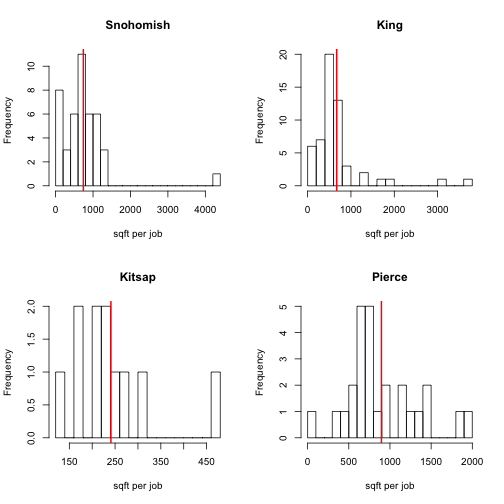

This homework combines everything we learned: reading data from a file, transforming and adding columns, subsetting, plotting, reading help files.

Write a script that reads the land use dataset `city__dataset_table__lu_indicators__2010.tab`, joins it with cities and counties and for each county it creates a histogram of the non-residential sqft per job ratio. The histogram should have 20 bins. It should also include a thick red vertical line at the mean value of the ratio per county. Your result should look like this:

Hint: See `?hist` to find out how to control the number of bins in a histogram. Also for the title, you can extract the county name by subsetting the dataset `counties`. Make the code more general by using the `for` loop described in [this](07-functions.html#control-flow) section.
